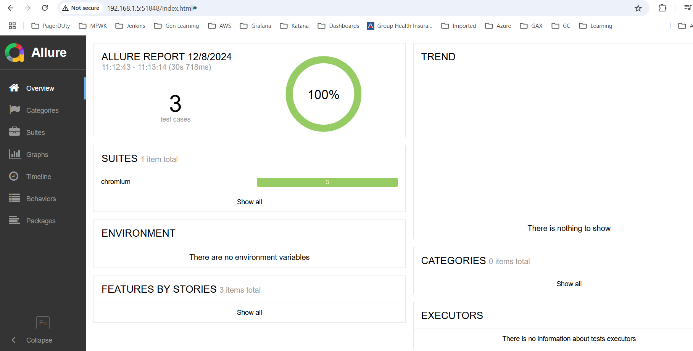
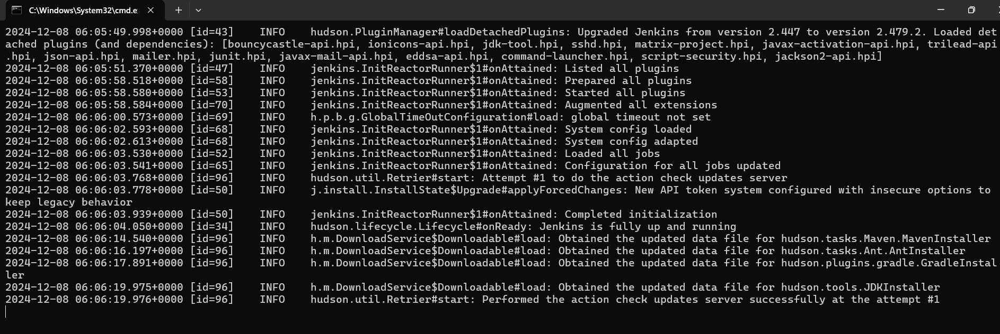

# Playwirght_demo using JavaScript
https://playwright.dev/java/docs/intro 

Playwright is a framework for Web Testing and Automation. It allows testing Chromium, Firefox and WebKit with a single API. Playwright is built to enable cross-browser web automation that is ever-green, capable, reliable and fast.

By default, Playwright runs the browsers in headless mode. To see the browser UI, pass the setHeadless(false) flag while launching the browser. You can also use slowMo to slow down execution. 
 playwright.firefox().launch(new BrowserType.LaunchOptions().setHeadless(false).setSlowMo(50));

 


### Command to run test with custom configuration
```
  projects: [
    {
      name: "chromium",
      use: {
        browserName: "chromium",
        trace: "on",
        headless: false,
        screenshot: "on",
      },
    },

    {
      name: "firefox",
      use: { 
        browserName: "firefox",
        trace: "on",
        headless: false,
        screenshot: "on",
      },
       },
 

    {
      name: "webkit",
      use: { 
        browserName: "webkit",
        trace: "on",
        headless: false,
        screenshot: "on",
      }
       },
      
],
```
npx playwright test --config .\playwright.config1.js 

npx playwright test --config .\playwright.config1.js --project=webkit

#### Run test using tag
npx playwright test --config .\playwright.config1.js --project=chromium --grep "@web"
```
test(`@web End to End testing`, async ({ page,testDataForOrder }) => {
  .....................
}
```

#### Allure report
npm install -g allure-commandline --save-dev

npm i allure-playwright

npx playwright test --config .\playwright.config1.js --project=chromium --grep "@web" --reporter=line,allure-playwright

allure generate ./allure-results --clean

allure open ./allure-report



#### Configure custom script to run the test

Update the custom test in package.json

  "scripts": {
    "test": "npx playwright test Login.spec.js --headed",
    "pomwebtest": "npx playwright test --config ./playwright.config1.js --project=chromium --grep '@web' --reporter=line,allure-playwright",
    "pomtest": "npx playwright test --config ./playwright.config1.js --project=chromium"
  }
  
  Then run the following command

  npm run pomtest

  #### Jenkins Configuration

  Download jenkin war - https://www.jenkins.io/download/

  java -jar jenkins.war --httpPort=9090

  

  #### Playwright Installation

  npm install typescript --save-dev
  
  tsc demo.ts
  node demo.js 

  https://playwright.dev/docs/test-typescript
  https://playwright.dev/docs/pom